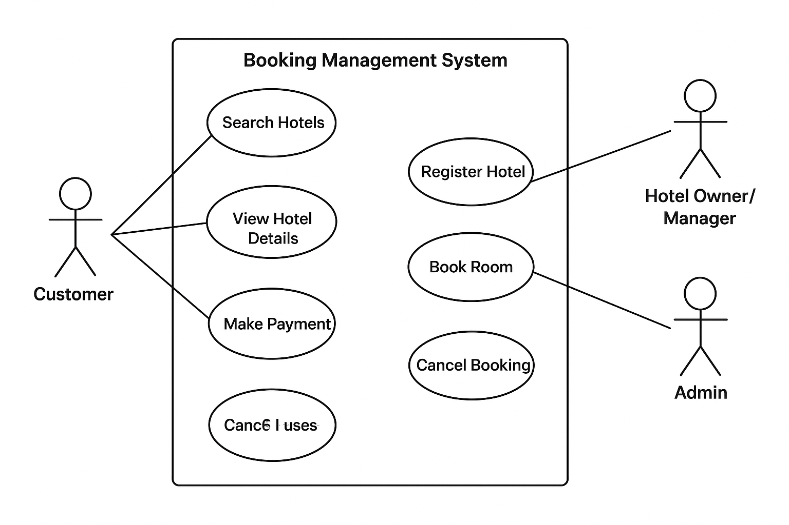

# requirement-analysis

# What is Requirement Analysis?

Requirement Analysis is a critical phase in the Software Development Lifecycle (SDLC) that focuses on identifying, gathering, and defining the needs and expectations of stakeholders for a software system. According to the SWEBOK Guide (IEEE Computer Society, 2014) and ISO/IEC/IEEE 29148:2018, requirements analysis ensures that the product being developed addresses the actual problems and objectives of users, customers, and the business.

Key Aspects of Requirement Analysis:

Elicitation – Gathering requirements from stakeholders, end-users, and domain experts.

Documentation – Recording requirements in clear, unambiguous, and structured formats.

Validation – Ensuring that requirements are correct, complete, consistent, and feasible.

Management – Tracking, updating, and controlling changes to requirements throughout the project.

Importance in SDLC:

Foundation for Design and Development
Requirement analysis provides the blueprint that guides system architecture, design, and coding. A well-defined set of requirements reduces ambiguity and helps developers build the right solution.

Minimizes Costly Errors
Studies show that fixing defects later in the development cycle is significantly more expensive than addressing them during requirements analysis. By clarifying needs early, teams can avoid misunderstandings and rework.

Improves Communication
It bridges the gap between stakeholders and the technical team. Clear requirements help align business goals with technical solutions.

Supports Testing and Validation
Requirements serve as the baseline for creating test cases. This ensures the final product meets both functional and non-functional expectations.

Enables Better Project Management
Accurate requirements improve effort estimation, scheduling, and risk management, leading to higher project success rates.

## Why is Requirement Analysis Important?

Requirement Analysis is a crucial step in the Software Development Lifecycle (SDLC) because it lays the foundation for building software that truly meets business needs and user expectations. Without it, projects often face misalignment, scope creep, or failure. Below are three key reasons why it is critical:

1. **Clarity of Objectives**  
   Requirement Analysis ensures that all stakeholders have a clear and shared understanding of the system’s goals. This helps avoid confusion, misinterpretations, and conflicting expectations later in the project.

2. **Risk Reduction**  
   By identifying potential challenges, constraints, and dependencies early, Requirement Analysis reduces the risk of costly errors, rework, or project failure. It provides a roadmap that helps the development team anticipate and mitigate risks.

3. **Efficient Resource Utilization**  
   With well-defined requirements, teams can allocate time, budget, and technical resources more effectively. This prevents wasted effort on unnecessary features and ensures that development is focused on delivering the highest-value outcomes.

## Key Activities in Requirement Analysis

Requirement Analysis involves a series of structured activities to ensure that the system being developed meets the needs of stakeholders. The five key activities are:

- **Requirement Gathering**  
  Collecting initial information from stakeholders, customers, and users about what the system should achieve. This step sets the foundation for further analysis.

- **Requirement Elicitation**  
  Using techniques such as interviews, surveys, workshops, brainstorming, and observation to uncover explicit and hidden requirements from stakeholders.

- **Requirement Documentation**  
  Recording requirements in a clear, organized, and structured manner (e.g., using Software Requirement Specification (SRS) documents). Documentation ensures requirements are accessible to all stakeholders.

- **Requirement Analysis and Modeling**  
  Analyzing requirements for feasibility, consistency, and completeness. Modeling techniques like use case diagrams, data flow diagrams (DFDs), or UML diagrams may be used to visualize and refine requirements.

- **Requirement Validation**  
  Ensuring that the documented requirements accurately reflect stakeholder needs. This may involve reviews, walkthroughs, or prototyping to confirm correctness and completeness.

  ## Types of Requirements

### Functional Requirements
These specify **what the system should do**—the actions and capabilities required to fulfill user and business needs. For a booking management system, they might include:

- **Hotel management by owners**: Ability for hotel managers or owners to register their hotel, add/update/delete room types and individual rooms, and define pricing and availability dynamically. :contentReference[oaicite:1]{index=1}  
- **Search and booking by customers**: Ability for users to search for hotels (by city, check-in/check-out dates), view available room types and prices, and make a booking. :contentReference[oaicite:2]{index=2}  
- **Booking notifications**: System automatically sends booking confirmation notifications to customers once their reservation is completed. :contentReference[oaicite:3]{index=3}  

### Non-functional Requirements
These specify **how the system performs the functions**—covering quality attributes like reliability, performance, and scalability. For the same booking system, examples include:

- **High availability and low latency**: The discovery/search platform should be highly available with fast response times, ensuring users can browse and book without delays. :contentReference[oaicite:4]{index=4}  
- **Strong consistency**: Especially critical in booking flows to prevent scenarios like double-booking of the same room. :contentReference[oaicite:5]{index=5}  
- **Scalability**: The system must scale effectively to handle increased traffic—from more users or hotel listings—without degradation of performance. :contentReference[oaicite:6]{index=6}  
- **Concurrency handling**: Ensure that multiple booking requests are processed correctly so that no two customers can book the same room for overlapping dates. :contentReference[oaicite:7]{index=7}  

## Use Case Diagrams

A **Use Case Diagram** is a visual representation of the interactions between **actors** (users or external systems) and the system itself. It helps in understanding the functional requirements, capturing user interactions, and defining the scope of the system.

**Benefits of Use Case Diagrams:**
- Provides a clear visualization of system functionality.
- Identifies actors and their interactions with the system.
- Helps in requirement validation and communication among stakeholders.

Below is the use case diagram for the booking management system:

## Acceptance Criteria

### Importance in Requirement Analysis
Acceptance Criteria define the conditions a feature must meet to be accepted by stakeholders. They ensure clarity, prevent scope creep, guide testing, and align development with business needs.

### Example: Checkout Feature in Booking System

**User Story**:  
As a customer, I want to complete my booking by checking out securely so I can confirm and pay for my reservation.

**Acceptance Criteria**:
- [ ] Display a summary of selected services, dates, and total cost before payment.
- [ ] Allow entry and real-time validation of payment details (card number, expiry, CVV).
- [ ] Process payment securely via a PCI-compliant gateway.
- [ ] On success, generate a booking ID, send a confirmation email, and show a success page.
- [ ] On failure, display a clear error and allow retry.
- [ ] Hold the reservation for 15 minutes during checkout to prevent double-booking.
